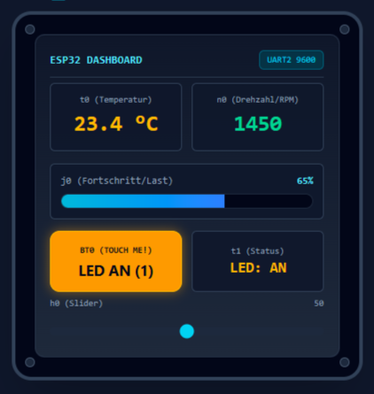

# ESP32 WROOM <-> Nextion 2.8" HMI Touch Dashboard (Bi-Direktional)

Ein robustes, bibliotheksfreies Arduino C++ Projekt zur **bi-direktionalen seriellen Kommunikation** zwischen einem **ESP32 WROOM** und einem **Nextion 2.8" TFT HMI-Touch-Display** über den Hardware-UART2.



---

## 🚀 Features

* **Echter Hardware-UART2 (`HardwareSerial 2`):** Verwendet GPIO 16 (RX2) und GPIO 17 (TX2). Der primäre USB-Port (`UART0` / Serial) bleibt zu 100 % frei für Delphi, den Seriellen Monitor oder PC-Schnittstellen.
* **Bi-direktionaler Datenaustausch:**
  * **ESP32 → Nextion:** Zyklisches Aktualisieren von Sensorwerten (Temperatur `t0.txt`, Drehzahl `n0.val`, Fortschrittsbalken `j0.val`).
  * **Nextion → ESP32:** Verarbeiten von Touch-Events (`0x65` Pakete) zum Schalten von GPIOs (LED / Relais).
  * **ESP32 → Nextion Rückmeldung:** Statusbestätigung und Farbumschaltung auf dem Display (`t1.txt="LED: AN"`).
* **Universeller & robuster Puffer-Parser:** Erkennt zuverlässig die 3x `0xFF` Endekennung von Nextion ohne blockierende Delays.
* **Keine externen Libraries nötig:** Verwendet reinen nativer ESP32-UART-Code ohne instabile oder veraltete Drittanbieter-Bibliotheken.

---

## 🔌 Hardware-Verkabelung (Pinout)

```text
┌────────────────────────────────┐                 ┌───────────────────────────────┐
│ NEXTION 2.8" HMI DISPLAY       │                 │ ESP32 WROOM DEVKIT            │
│ (z. B. NX3224T028 / NX3224K028)│                 │                               │
│                                │                 │                               │
│  [+] +5V (Rotes Kabel)         ├─────────────────┤ VIN / 5V (oder ext. 5V Netzteil)│
│  [-] GND (Schwarzes Kabel)     ├─────────────────┤ GND (Gemeinsame Masse)        │
│  [TX] Blaues Kabel             ├─────────────────┤ RX2 (GPIO 16)                 │
│  [RX] Gelbes Kabel             ├─────────────────┤ TX2 (GPIO 17)                 │
└────────────────────────────────┘                 └───────────────────────────────┘
```

| Nextion Pin | Kabelfarbe | ESP32 WROOM Pin | Funktion |
| :--- | :--- | :--- | :--- |
| **+5V** | Rot | **VIN (5V)** | Spannungsversorgung (mind. 500 mA empfohlen) |
| **GND** | Schwarz | **GND** | Gemeinsame Masse |
| **TX** | Blau | **GPIO 16 (RX2)** | Nextion sendet Touch-Daten an ESP32 |
| **RX** | Gelb | **GPIO 17 (TX2)** | ESP32 sendet Messwerte & Strings an Nextion |

> ⚠️ **Stromversorgungs-Hinweis:** Das Nextion-Display zieht beim Einschalten Spitzenströme bis ca. 350–400 mA. Bei instabilem Betrieb oder Flackern wird ein externes 5V-Netzteil (GND mit ESP32 verbinden!) empfohlen.

---

## 🖥️ Einrichtung im Nextion Editor

Erstelle im offiziellen **Nextion Editor** ein Projekt mit der Auflösung deines Displays (z. B. 320x240 Querformat / 90° Landscape) und platziere folgende Komponenten auf `page 0`:

| Komponenten-Typ | Objektname (`objname`) | Beschreibung | Wichtige Attribute |
| :--- | :--- | :--- | :--- |
| **Text** | `t0` | Temperaturanzeige (z. B. "23.4 °C") | `txt_maxl`: 15 |
| **Number** | `n0` | Numerischer Wert (Drehzahl / RPM) | `vvs1`: 0 |
| **Progressbar** | `j0` | Fortschrittsbalken (0–100 %) | `val`: 0, `maxval`: 100 |
| **Dual-State Button** | `bt0` | Touch-Schaltfläche (LED / Relais) | **Touch Press Event: `[x] Send Component ID`** |
| **Text** | `t1` | Statusanzeige der LED ("LED: AN" / "LED: AUS") | `txt_maxl`: 15 |

### ⚠️ Wichtigste Einstellung für Touch-Events:
1. Wähle den Button `bt0` an.
2. Setze im unteren Fenster unter **Touch Press Event** das Häkchen bei **`[x] Send Component ID`**.
3. *Erst dadurch schickt das Nextion-Display beim Berühren das 0x65-Datenpaket an den ESP32!*

---

## 📡 Das Nextion-Protokoll im Detail

### 1. ESP32 an Nextion (Befehle senden)
Jeder Befehl an das Display ist ein lesbarer ASCII-String, der **zwingend mit 3 Bytes des Wertes `0xFF` (`255`)** abgeschlossen werden muss:

* **Text ändern:** `t0.txt="23.4 °C"` + `0xFF 0xFF 0xFF`
* **Zahlenwert ändern:** `n0.val=1450` + `0xFF 0xFF 0xFF`
* **Fortschritt ändern:** `j0.val=65` + `0xFF 0xFF 0xFF`

### 2. Nextion an ESP32 (Touch-Event empfangen)
Wenn eine Schaltfläche mit aktiviertem *Send Component ID* berührt wird, sendet Nextion ein 7-Byte-Paket:

```text
┌──────┬────────┬─────────────┬───────────┬───────────────────┐
│ 0x65 │ PageID │ ComponentID │ EventType │  0xFF  0xFF  0xFF │
└──────┴────────┴─────────────┴───────────┴───────────────────┘
```
* `0x65`: Kennung für Touch-Ereignis
* `PageID`: Seitennummer (z. B. `0x00` für Page 0)
* `ComponentID`: Interne ID des gedrückten Elements im Nextion Editor
* `EventType`: `0x01` = Press (Gedrückt), `0x00` = Release (Losgelassen)
* `0xFF 0xFF 0xFF`: Standard-Endekennung

---

## 💻 Vollständiger ESP32 C++ Code (`ESP32_Nextion_UART2.ino`)

```cpp
/* ==========================================================================
 * ESP32 WROOM <-> NEXTION 2.8" DISPLAY (BI-DIREKTIONALE KOMMUNIKATION)
 * Hardware-UART2: RX2 = GPIO 16, TX2 = GPIO 17 (9600 Baud)
 * USB-UART0: Debug-Monitor & Delphi Host (115200 Baud)
 * ========================================================================== */

#include <Arduino.h>

// Pins fuer Nextion Display an HardwareSerial 2 des ESP32
#define NEXTION_RX_PIN 16 // Verbinden mit Nextion TX (Blau)
#define NEXTION_TX_PIN 17 // Verbinden mit Nextion RX (Gelb)
#define NEXTION_BAUD   9600

// LED Pin (GPIO 2 ist die blaue Onboard-LED der meisten ESP32 DevKits)
#define ONBOARD_LED 32

HardwareSerial NextionSerial(2); // Nutzt Hardware-UART2

// -----------------------------------------------------------------------------
// 1. HILFSFUNKTIONEN ZUM SENDEN AN DAS NEXTION DISPLAY
// -----------------------------------------------------------------------------

// Sendet Befehl + 3x 0xFF Abschluss
void nextion_send_cmd(const String& cmd) {
    NextionSerial.print(cmd);
    NextionSerial.write(0xFF);
    NextionSerial.write(0xFF);
    NextionSerial.write(0xFF);
}

// Textfeld aktualisieren (z. B. t0.txt="23.4 °C")
void nextion_set_text(const String& component, const String& text) {
    String cmd = component + ".txt=\"" + text + "\"";
    nextion_send_cmd(cmd);
}

// Zahlenwert oder Progressbar aktualisieren (z. B. n0.val=1450 oder j0.val=65)
void nextion_set_number(const String& component, int32_t val) {
    String cmd = component + ".val=" + String(val);
    nextion_send_cmd(cmd);
}

// Hintergrundfarbe aendern (16-Bit RGB565)
void nextion_set_bgcolor(const String& component, uint16_t color565) {
    String cmd = component + ".bco=" + String(color565);
    nextion_send_cmd(cmd);
}

// -----------------------------------------------------------------------------
// 2. EMPFANGS-LOGIK: TOUCH-EVENTS VOM NEXTION VERARBEITEN
// -----------------------------------------------------------------------------

void handle_nextion_data() {
    static uint8_t rx_buffer[32];
    static uint8_t rx_index = 0;
    static uint8_t ff_count = 0;

    while (NextionSerial.available()) {
        uint8_t b = NextionSerial.read();

        // Auf 3x 0xFF Endekennung pruefen
        if (b == 0xFF) {
            ff_count++;
            if (ff_count == 3) {
                // Touch-Event Paket: 0x65 [PageID] [ComponentID] [EventType]
                if (rx_index >= 4 && rx_buffer[0] == 0x65) {
                    uint8_t pageId    = rx_buffer[1];
                    uint8_t compId    = rx_buffer[2];
                    uint8_t eventType = rx_buffer[3]; // 1 = Press, 0 = Release

                    Serial.printf("[NEXTION TOUCH] Page: %d | Component-ID: %d | Event: %s\r\n",
                                  pageId, compId, (eventType == 1 ? "PRESS" : "RELEASE"));

                    // Universal-Umschaltung: Reagiert auf Tastendruck
                    if (eventType == 1 || eventType == 0) {
                        static bool ledState = false;
                        ledState = !ledState;
                        
                        // LED schalten
                        digitalWrite(ONBOARD_LED, ledState ? HIGH : LOW);

                        Serial.printf("--> [AKTION] LED an GPIO %d umgeschaltet: %s\r\n",
                                      ONBOARD_LED, ledState ? "AN (HIGH)" : "AUS (LOW)");

                        // Rueckmeldung & Status an Nextion Display schicken
                        if (ledState) {
                            nextion_set_text("t1", "LED: AN");
                            nextion_set_number("bt0", 1);
                        } else {
                            nextion_set_text("t1", "LED: AUS");
                            nextion_set_number("bt0", 0);
                        }
                    }
                }

                // Puffer fuer naechste Nachricht leeren
                rx_index = 0;
                ff_count = 0;
                continue;
            }
        } else {
            ff_count = 0;
            if (rx_index < sizeof(rx_buffer) - 1) {
                rx_buffer[rx_index++] = b;
            }
        }
    }
}

// -----------------------------------------------------------------------------
// 3. SETUP & HAUPTSCHLEIFE
// -----------------------------------------------------------------------------

void setup() {
    // Debug-Monitor via USB (UART0)
    Serial.begin(115200);

    pinMode(ONBOARD_LED, OUTPUT);
    digitalWrite(ONBOARD_LED, LOW);

    // Hardware-UART2 fuer Nextion initialisieren
    NextionSerial.begin(NEXTION_BAUD, SERIAL_8N1, NEXTION_RX_PIN, NEXTION_TX_PIN);

    delay(500); // Warten auf Display-Start

    Serial.println("=================================================");
    Serial.println(" ESP32 WROOM <-> Nextion 2.8\" UART2 Gestartet   ");
    Serial.println("=================================================");

    // Initiale Werte auf dem Display setzen
    nextion_set_text("t0", "ESP32 Start");
    nextion_set_text("t1", "LED: AUS");
    nextion_set_number("n0", 0);
    nextion_set_number("j0", 0);
}

static uint32_t last_sensor_time = 0;
static float sim_temperature = 23.4;
static int sim_rpm = 1450;
static int sim_progress = 65;

void loop() {
    // 1. Laufend Touch-Ereignisse vom Nextion abfragen
    handle_nextion_data();

    // 2. Alle 1000 ms neue Messwerte an Nextion senden
    if (millis() - last_sensor_time >= 1000) {
        last_sensor_time = millis();

        // Messwerte simulieren
        sim_temperature += ((random(0, 20) - 10) / 10.0);
        if (sim_temperature < 18.0) sim_temperature = 18.0;
        if (sim_temperature > 35.0) sim_temperature = 35.0;

        sim_rpm += (random(-50, 50));
        sim_progress = (sim_progress + 5) % 105;

        // An Nextion senden
        char tempStr[16];
        snprintf(tempStr, sizeof(tempStr), "%.1f C", sim_temperature);
        nextion_set_text("t0", tempStr);
        nextion_set_number("n0", sim_rpm);
        nextion_set_number("j0", sim_progress);

        Serial.printf("[SENSOR UPDATE] Temp: %s | RPM: %d | Progress: %d%%\r\n",
                      tempStr, sim_rpm, sim_progress);
    }
}
```

---

## 🛠️ Fehlerbehebung & Häufige Fallstricke

| Symptom | Ursache | Lösung |
| :--- | :--- | :--- |
| **Touch wird im Monitor erkannt, aber LED/Text schaltet nicht** | Falsche `Component-ID` oder falscher Komponentenname | Im Seriellen Monitor nach `Component-ID: X` schauen. Sicherstellen, dass das Textfeld in Nextion exakt `t1` heißt und `txt_maxl >= 15` ist. |
| **Display zeigt nach ESP32-Start gar nichts an** | TX/RX vertauscht | GPIO 16 (ESP32 RX2) muss an Nextion TX (Blau), GPIO 17 (ESP32 TX2) an Nextion RX (Gelb). |
| **Display flackert oder startet neu** | Zu wenig Strom über USB | Externes 5V-Netzteil an Nextion anschließen (GND verbinden!). |
| **Nextion reagiert nicht auf Berührung** | Häkchen fehlt im Nextion Editor | Button anklicken → Touch Press Event → **`Send Component ID`** aktivieren. |

---

## 📄 Lizenz
MIT License. Freie Verwendung für private und industrielle Projekte.